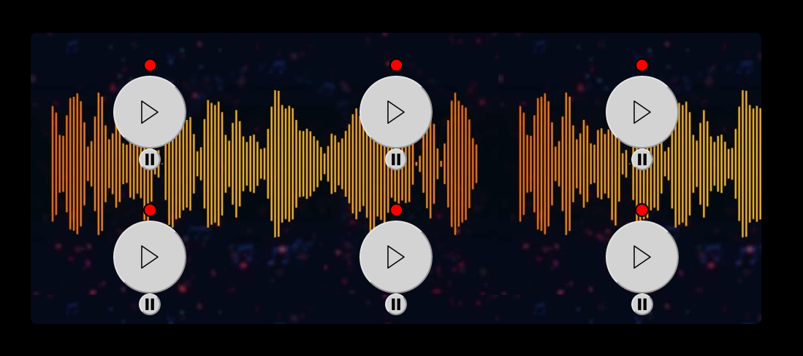

# Musical-Box 🎵


>Um software "Inútil", desenvolvido para disciplina Computadores e Sociedades, UFSJ, Brazil. Com objetivo de estudar a música como estado da arte. 

## Run

```sh
git clone https://github.com/LucasVidigal98/Musical-Box.git
```

```sh
cd Musical-Box
```

```sh
npm install && npm start
```


